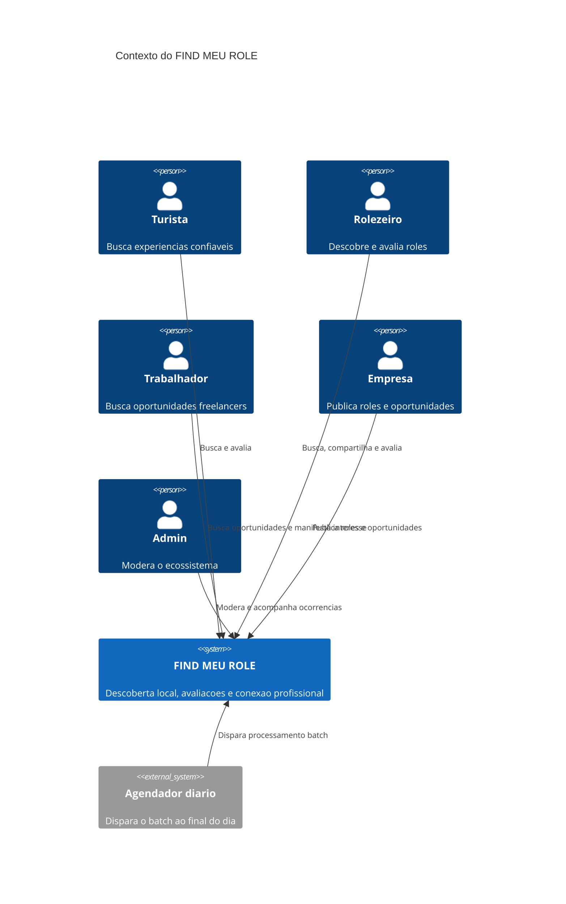
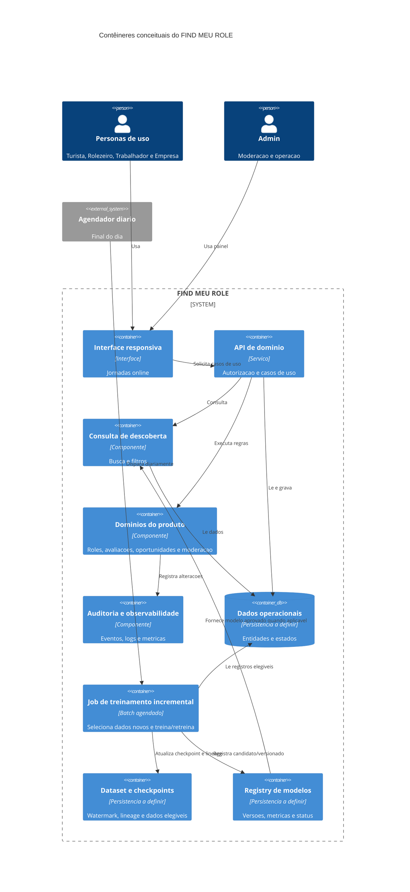
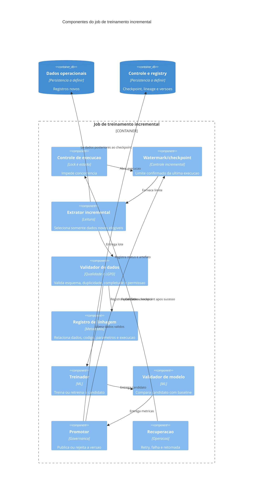
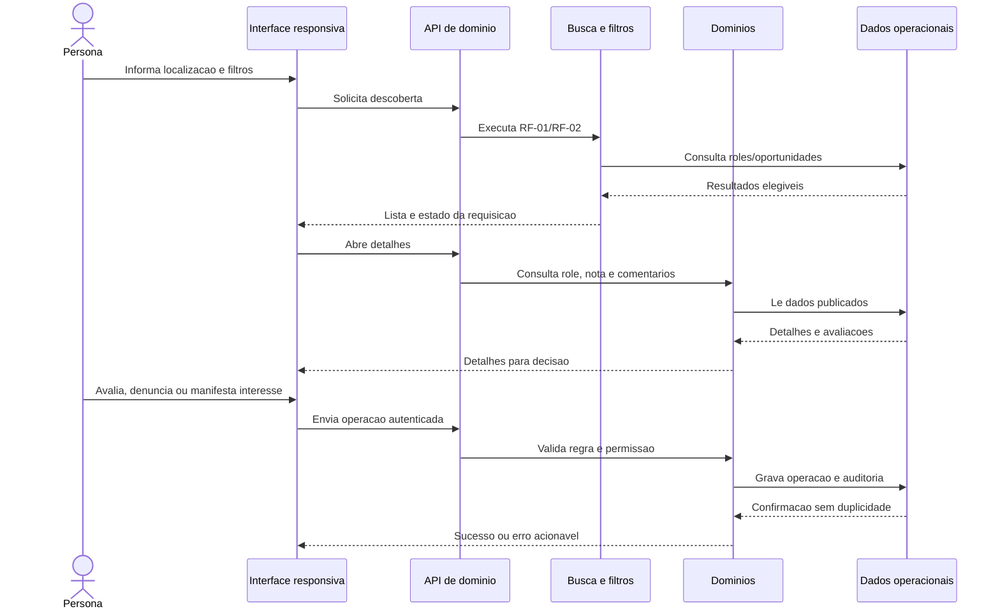
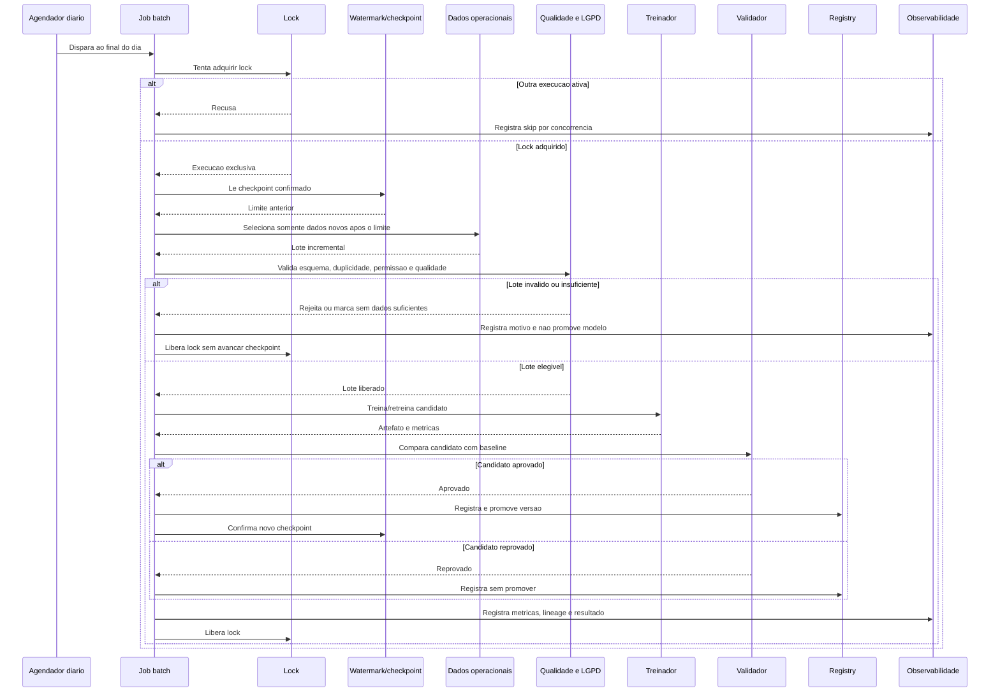

# Arquitetura do FIND MEU ROLE

## 1. Contexto e objetivo

### Contexto

O FIND MEU ROLE e uma plataforma local de descoberta e conexao. O produto aproxima tres necessidades documentadas: pessoas que procuram experiencias, empresas que divulgam roles e oportunidades, e trabalhadores que procuram trabalhos freelancers.

O MVP tem duas capacidades centrais: encontrar roles e avaliar roles. A conexao profissional e o segundo fluxo prioritario. Preferencias, recomendacoes, roles salvos, alertas e historico aparecem na Fase 3 da visao do produto.

**Fontes:** [docs/product/visao-do-produto.md](product/visao-do-produto.md), [README.md](../README.md).

### Objetivo arquitetural

Estabelecer uma base para que o produto:

- permita descoberta local por busca e filtros;
- preserve a confianca nas avaliacoes e nos dados moderados;
- conecte empresas e trabalhadores por oportunidades vinculadas a roles;
- proteja dados pessoais, contatos e candidaturas;
- permita evolucao para novas cidades, categorias e funcoes;
- mantenha visiveis as lacunas que precisam de decisao antes da implementacao.

Este documento nao escolhe tecnologias, banco de dados, provedores ou volumes alem do que ja foi registrado nos artefatos de origem.

## 2. Stakeholders e personas

| Stakeholder/persona | Necessidade documentada | Fonte |
| --- | --- | --- |
| Turista | Encontrar experiencias confiaveis, comparando preco, distancia, horario e avaliacao. | [docs/personas/turista.md](personas/turista.md) |
| Rolezeiro | Descobrir roles alinhados a gosto, momento e orcamento, e contribuir com avaliacoes. | [docs/personas/rolezeiro.md](personas/rolezeiro.md) |
| Trabalhador | Encontrar oportunidades compativeis com funcao, localizacao e disponibilidade. | [docs/personas/trabalhador.md](personas/trabalhador.md); RF-09 a RF-11 |
| Empresa | Publicar roles e oportunidades e encontrar profissionais adequados. | [docs/personas/empresa.md](personas/empresa.md); RF-07 e RF-08 |
| Admin | Moderar usuarios, roles, oportunidades e avaliacoes com rastreabilidade. | [docs/personas/admin.md](personas/admin.md); RF-06 e RF-12 |
| Equipe de produto/operação | Consultar logs, indicadores e a saude do ecossistema. | RNF-27; persona Admin |

As personas sao hipoteses iniciais e devem ser validadas por entrevistas e observacao, conforme [docs/personas/README.md](personas/README.md).

## 3. Requisitos arquiteturalmente significativos

- **Busca e filtros:** busca por cidade, bairro, categoria e palavra-chave, com filtros de data, horario, preco, distancia e tipo de experiencia (**RF-01**, **RF-02**).
- **Detalhes e localizacao:** exibicao de descricao, categoria, local, horario, preco, contato e imagens quando disponiveis (**RF-03**).
- **Confianca das avaliacoes:** exibicao de nota, quantidade e comentarios; avaliacao condicionada a participacao ou regra de verificacao (**RF-04**, **RF-05**).
- **Moderacao:** denuncias de avaliacao, role ou perfil e moderacao administrativa de usuarios, roles, oportunidades e avaliacoes (**RF-06**, **RF-12**).
- **Conexao profissional:** empresa cadastra roles e oportunidades; trabalhador informa perfil, experiencia e disponibilidade, busca oportunidades e manifesta interesse (**RF-07** a **RF-11**).
- **Integridade de dominio:** avaliacao vinculada a role; no maximo uma avaliacao ativa por usuario e participacao; nota calculada apenas com avaliacoes validas e publicadas; conteudo denunciado pode ser ocultado (**Regras de negocio iniciais** em [docs/product/requisitos.md](product/requisitos.md)).
- **Dados obrigatorios de oportunidade:** funcao, data, local e forma de contato ou candidatura (**Regras de negocio iniciais**).
- **Treinamento incremental:** existe um cron job executado diariamente ao final do dia para treinar ou retreinar usando somente dados novos (**restricao informada diretamente pelo usuario nesta solicitacao**). Esta restricao nao aparece nos artefatos anteriores e nao deve ser tratada como fato preexistente.

## 4. Atributos de qualidade

Os atributos abaixo sao os requisitos de qualidade ja registrados segundo a ISO/IEC 25010:2011 em [docs/product/requisitos.md](product/requisitos.md):

- **Adequacao funcional:** RNF-01 a RNF-03.
- **Eficiencia de desempenho:** RNF-04 a RNF-06, incluindo a meta documentada de ate 2 segundos em 95% das requisicoes e as capacidades minimas registradas.
- **Compatibilidade:** RNF-07 e RNF-08.
- **Usabilidade:** RNF-09 a RNF-15, incluindo responsividade, teclado, foco, labels e referencia WCAG 2.1 AA.
- **Confiabilidade:** RNF-16 a RNF-19, incluindo disponibilidade mensal de 99% no piloto, retry sem duplicidade e recuperacao de dados.
- **Seguranca:** RNF-20 a RNF-24, incluindo confidencialidade, integridade, nao repudio, responsabilizacao e autenticidade.
- **Manutenibilidade:** RNF-25 a RNF-29, incluindo separacao de responsabilidades, logs estruturados e testabilidade sem servicos externos.
- **Portabilidade:** RNF-30 a RNF-32, incluindo adaptabilidade de telas, instalabilidade e adaptadores para integracoes.

Os limites numericos sao metas iniciais do MVP e devem ser confirmados durante o piloto, conforme o proprio documento de requisitos.

## 5. Drivers arquiteturais priorizados

| Prioridade | Driver | Origem |
| --- | --- | --- |
| P0 | Entregar busca e filtros de roles dentro da meta de desempenho documentada. | RF-01, RF-02, RNF-04 |
| P0 | Preservar confianca, verificabilidade e integridade das avaliacoes. | RF-04, RF-05, Regras de negocio iniciais, RNF-02, RNF-21 |
| P0 | Permitir moderacao rastreavel de conteudo e perfis. | RF-06, RF-12, RNF-22, RNF-23 |
| P0 | Restringir acesso a dados pessoais, contatos e candidaturas. | RNF-20, RNF-24 |
| P0 | Evitar duplicidade em avaliacao, denuncia e candidatura quando houver retry ou falha. | RNF-18; Regra de negocio sobre avaliacao ativa |
| P0 | Executar treinamento/retreinamento diario no final do dia usando somente dados novos. | Restricao informada pelo usuario nesta solicitacao |
| P1 | Separar responsabilidades de busca, avaliacao, oportunidades, perfis e moderacao para evolucao localizada. | RF-07 a RF-11, RNF-25 |
| P1 | Permitir evolucao para novas cidades, categorias, funcoes e filtros. | RNF-28; Fase 3 em [docs/product/visao-do-produto.md](product/visao-do-produto.md) |
| P1 | Isolar mapas, imagens e notificacoes das regras de negocio. | RNF-08, RNF-32 |
| P1 | Dar visibilidade operacional por logs estruturados, correlacao, indicadores e backups. | RNF-19, RNF-27; necessidades da persona Admin |
| P1 | Atender as jornadas principais em mobile, desktop e tecnologias assistivas quando aplicavel. | RNF-11, RNF-13, RNF-30 |
| P2 | Suportar preferencias, recomendacoes, favoritos, alertas e historico. | Fase 3 em [docs/product/visao-do-produto.md](product/visao-do-produto.md) |

## 6. Fatos, lacunas, conflitos e suposicoes

### Fatos documentados

- O produto se chama FIND MEU ROLE e possui os perfis Turista, Rolezeiro, Trabalhador, Empresa e Admin.
- O MVP prioriza descoberta e avaliacao; a conexao profissional e o segundo fluxo.
- Os RF-01 a RF-12, RNF-01 a RNF-32 e as regras de negocio estao definidos em [docs/product/requisitos.md](product/requisitos.md).
- O modelo de qualidade adotado nos requisitos e ISO/IEC 25010:2011.
- A contratacao completa e marketplace de pagamentos estao fora do escopo inicial.

### Lacunas

- Nao ha definicao de identidade, autenticacao, recuperacao de conta ou matriz detalhada de autorizacao.
- A regra concreta para comprovar participacao antes de avaliar nao foi definida.
- Nao ha estados e transicoes definidos para roles, oportunidades, avaliacoes e denuncias.
- Nao ha escolha de persistencia, indices, busca geografica/textual, APIs, eventos ou provedores externos.
- Nao ha politica de consentimento, retencao, exclusao e anonimização de dados.
- Nao ha definicao de verificacao de empresas e trabalhadores.
- Oportunidades nao tornam remuneracao obrigatoria, embora ela apareca como dor do trabalhador.
- Nao ha definicao de paginacao, ordenacao, ranking, uploads ou limites de imagens/portfolio.
- Para o cron job, faltam fonte dos dados, janela que define “novos”, modelo, metricas, criterio de promocao, rollback, monitoramento de drift e politica para dados insuficientes.

### Conflitos ou desalinhamentos

- O README trata descoberta e avaliacao como capacidades centrais do MVP, enquanto a visao inclui cadastro, perfil basico e moderacao na Fase 1.
- O README chama conexao profissional de segundo fluxo, mas os requisitos classificam RF-12 como Must e RF-07 a RF-11 como Should.
- Preferencias aparecem na jornada atual do Rolezeiro e em RF-02, mas preferencias e recomendacoes sao posicionadas na Fase 3.
- A persona Empresa espera responder avaliacoes e consultar desempenho, mas essas capacidades nao estao explicitas nos RFs.
- A persona Trabalhador espera historico de candidaturas e oportunidades, mas isso nao esta explicito nos RFs.

### Suposicoes a validar

- A primeira experiencia sera web responsiva, pois os requisitos mencionam mobile e desktop, mas nao definem aplicativo nativo.
- Publicar, avaliar, denunciar e manifestar interesse exigirao conta autenticada.
- Conteudo moderado tera estados publicados, ocultos ou restaurados, embora os nomes e transicoes ainda nao estejam definidos.
- A contratacao continuara fora da plataforma no MVP, conforme o README.
- O cron job nao deve bloquear nem degradar as jornadas online; isso e uma suposicao operacional a validar, nao um requisito existente.

## 7. Perguntas abertas

1. Qual cidade sera usada no piloto?
2. O produto sera exclusivamente web ou tambem tera aplicativo nativo?
3. Como sera comprovada a participacao em um role?
4. Quais papeis administrativos e limites de autorizacao existirao?
5. Empresas e trabalhadores terao verificacao de identidade ou perfil?
6. A candidatura ocorrera dentro da plataforma ou por contato externo?
7. Oportunidades devem informar remuneracao?
8. Quais estados e transicoes existem para roles, oportunidades, denuncias e avaliacoes?
9. Qual politica de LGPD, consentimento, retencao e exclusao sera aplicada?
10. Quais dados o cron job pode usar e o que significa exatamente “somente dados novos”?
11. Qual modelo ou algoritmo sera treinado ou retreinado?
12. Como o modelo sera validado, promovido e revertido?
13. Quais metricas definirao melhoria e como sera evitado vazamento de dados pessoais ou conteudo moderado?
14. Qual e o escopo aprovado do MVP para preferencias e recomendacoes?

## 8. Glossario

- **Role:** experiencia local, como festa, restaurante, museu, show ou evento.
- **Experiencia:** atividade ou estabelecimento descoberto pela pessoa usuaria.
- **Oportunidade:** necessidade de trabalho vinculada a um role.
- **Avaliacao:** nota e comentario sobre um role apos participacao verificada ou regra definida.
- **Participacao:** evidencia de que a pessoa esteve ou participou do role.
- **Denuncia:** registro de conteudo ou perfil reportado para moderacao.
- **Moderacao:** analise e decisao administrativa sobre conteudo, usuario ou ocorrencia.
- **Interesse:** manifestacao de candidatura de um trabalhador a uma oportunidade.
- **Persona:** hipotese de grupo de usuario com objetivos, dores e necessidades.
- **Dados novos:** dados ainda nao utilizados por uma execucao anterior de treinamento; a definicao operacional esta pendente.
- **Cron job:** tarefa agendada automaticamente, neste caso executada diariamente ao final do dia.
- **Treinar/retreinar:** criar um modelo ou atualizar um modelo existente com dados permitidos.
- **Adaptador:** componente que isola uma integracao externa das regras de negocio.

## 9. Riscos iniciais

| Risco | Impacto | Origem ou mitigacao a investigar |
| --- | --- | --- |
| Avaliacoes fraudulentas ou nao verificadas | Reduz a confianca de turistas, rolezeiros e empresas. | RF-05, regras de negocio, RNF-21; definir verificacao e auditoria. |
| Conteudo falso ou desatualizado | Prejudica decisoes e a reputacao do ecossistema. | Personas Turista, Rolezeiro e Admin; definir ciclo de atualizacao e moderacao. |
| Vazamento de dados pessoais ou candidaturas | Risco de seguranca, privacidade e reputacao. | RNF-20, RNF-24; definir autorizacao, minimizacao e retencao. |
| Busca lenta ou resultados inconsistentes | Compromete o principal fluxo do MVP. | RF-01, RF-02, RNF-02, RNF-04; validar indexacao, paginacao e testes de carga. |
| Acoplamento a provedores externos | Dificulta substituicao e evolucao. | RNF-08, RNF-32; definir adaptadores e contratos. |
| Moderacao sem rastreabilidade | Pode causar decisoes injustas ou impossiveis de revisar. | Persona Admin, RNF-22, RNF-23; definir historico e transicoes. |
| Escopo excessivo no MVP | Aumenta complexidade e pode atrasar a validacao central. | README, visao do produto e conflitos registrados nesta arquitetura. |
| Treinamento com dados repetidos, indevidos ou insuficientes | Degrada o modelo e pode expor dados. | Restricao do cron job; definir dataset incremental, lineage, validacao e fallback. |
| Cron job competindo com as jornadas online | Pode degradar o desempenho de busca e listagem. | RNF-04 e restricao do cron job; isolamento e limites ainda nao definidos. |
| Retreinamento sem melhoria real | Atualizacao diaria pode piorar o comportamento do modelo. | Restricao do cron job; definir baseline, metricas, aprovacao e rollback. |
| Falta de dados historicos no piloto | Recomendacoes podem ser pouco confiaveis. | Fase 3 e fora do escopo de recomendacao avancada; definir fallback. |

## 10. Responsabilidades, limites e interfaces

Esta seção é uma proposta arquitetural. Ela não altera RFs, RNFs ou regras de negócio. Decisões sem requisito explícito estão marcadas para validação.

| Contexto | Responsabilidade | Limite | Justificativa |
| --- | --- | --- | --- |
| Identidade e acesso | Autenticar contas e fornecer contexto de autorização. | Não decide validade de avaliação, moderação ou modelo. | RNF-20, RNF-24; matriz de perfis é lacuna. |
| Catálogo de roles | Manter cadastro, edição, estado e dados de descoberta. | Não calcula reputação nem modera por conta própria. | RF-01 a RF-03, RF-07, RNF-25. |
| Busca e filtros | Consultar roles e oportunidades por texto, localização, data, preço, distância, categoria e função. | Não altera a fonte nem promove modelo. | RF-01, RF-02, RF-10, RNF-04, RNF-28. |
| Avaliações | Registrar avaliações e expor apenas agregados válidos e publicados. | Não define a regra concreta de comprovação de participação. | RF-04, RF-05 e regras de negócio; verificação é lacuna. |
| Oportunidades | Manter oportunidades vinculadas a roles, perfis, disponibilidade e interesses. | Não realiza contratação completa nem pagamentos. | RF-08 a RF-11 e fora do escopo inicial. |
| Moderação | Receber denúncias, consultar contexto, registrar decisão e controlar visibilidade. | Não apaga evidência histórica sem política aprovada. | RF-06, RF-12, RNF-22, RNF-23. |
| Integrações | Encapsular mapas, imagens, notificações e contato. | Não contém regras centrais do domínio. | RNF-08, RNF-32. |
| Dados e auditoria | Persistir entidades, estados, alterações, métricas e execuções. | Não define retenção ou anonimização ainda não aprovadas. | RNF-19, RNF-21, RNF-27. |
| Treinamento batch | Selecionar dados novos, preparar dataset, treinar/retreinar, validar e registrar modelo. | Não bloqueia o online e não usa dados fora do escopo permitido. | Restrição do usuário, RNF-04, RNF-18. |

### Limites online e batch

- **Online:** autenticação, cadastro, busca, detalhes, avaliações, denúncias, oportunidades e interesses.
- **Batch:** seleção incremental, preparação, treinamento/retreinamento, avaliação offline e registro de modelo.
- **Contrato:** o online grava dados com identificador e marca temporal; o batch lê somente registros elegíveis após checkpoint confirmado.
- **Decisão sem requisito:** a busca deve manter comportamento determinístico/fallback sem modelo aprovado, para não transformar a recomendação da Fase 3 em dependência do MVP.

### Interfaces conceituais

| Interface | Consumidor | Provedor | Dados mínimos | Origem |
| --- | --- | --- | --- | --- |
| Catálogo de roles | Busca, detalhes, empresa, moderação | Catálogo de roles | Identificador, descrição, categoria, local, horário, preço, contato, imagens e estado | RF-01 a RF-03, RF-07 |
| Consulta de descoberta | Turista, Rolezeiro, Trabalhador | Busca e filtros | Texto, localização, filtros, resultados e paginação a definir | RF-01, RF-02, RF-10, RNF-04 |
| Avaliação | Usuário, detalhes, moderação | Avaliações | Usuário, role, participação/verificação, nota, comentário, data e estado | RF-04, RF-05, RNF-21 |
| Denúncia e moderação | Admin | Moderação | Alvo, autor, motivo, status, responsável, decisão e histórico | RF-06, RF-12, RNF-23 |
| Oportunidade e interesse | Empresa, Trabalhador | Oportunidades | Role, função, data, local, requisitos, candidatura e disponibilidade | RF-08 a RF-11 |
| Integração externa | Domínios online | Adaptadores | Pedido e resposta normalizados | RNF-08, RNF-18, RNF-32 |
| Dataset incremental | Job batch | Dados operacionais | Registros novos elegíveis, origem, timestamp e checkpoint | Restrição do usuário, RNF-19 |
| Registro de modelo | Online e operação | Registry a definir | Versão, dataset, métricas, status e artefato | Restrição do usuário, RNF-27 |

### Alternativas abertas

| Decisão | Alternativas | Situação |
| --- | --- | --- |
| Busca | Consulta direta ou índice dedicado de texto/geolocalização | Não decidir sem volume, latência e tecnologia definidos; RNF-04 e RNF-06 são critérios. |
| Comunicação | Chamadas síncronas ou eventos assíncronos | Não decidir sem estados, consistência e integrações definidos. |
| Incrementalidade | Watermark temporal ou log de mudanças | Proposta: começar com watermark persistido; decisão sem requisito. |
| Promoção | Automática por métrica ou aprovação explícita | Proposta: aprovação explícita até métricas e risco serem validados; decisão sem requisito. |

## 11. Visões C4 em Mermaid

As visões são conceituais. Nomes como banco, registry, agendador e provedores não representam tecnologias escolhidas.

### 11.1 Contexto



### 11.2 ADRs do painel revisor

Os ADRs abaixo registram decisões arquiteturais propostas para avaliação. Eles não alteram a fonte de verdade. Quando a decisão não possui requisito explícito, isso é indicado.

### ADR-001: Separação entre fluxo online e treinamento batch

- **Contexto:** o produto precisa atender descoberta, avaliações e oportunidades online, além de executar treinamento/retreinamento diário somente com dados novos.
- **Forças:** RNF-04 exige desempenho interativo; a restrição do usuário exige processamento diário; RNF-25 exige responsabilidades separadas.
- **Alternativas:** executar treinamento no mesmo fluxo online; executar batch isolado; adiar o treinamento.
- **Decisão:** adotar fluxo online separado do job batch, com dados e controle de execução próprios.
- **Consequências:** reduz interferência entre jornadas e processamento; adiciona controle de dados, operação e observabilidade.
- **Riscos:** isolamento técnico e recursos ainda não definidos; o job pode afetar disponibilidade se a separação for apenas lógica.
- **Requisitos:** RF-01 a RF-12, RNF-04, RNF-18, RNF-25; restrição do usuário.

### ADR-002: Processamento incremental por checkpoint confirmado

- **Contexto:** o job deve usar somente dados novos e pode falhar parcialmente.
- **Forças:** evita perda de dados e permite reprocessamento; exige idempotência para não duplicar trabalho.
- **Alternativas:** watermark temporal; log de mudanças; reprocessamento integral diário.
- **Decisão:** propor watermark/checkpoint persistido, avançado somente após as etapas da execução serem concluídas conforme a política de promoção.
- **Consequências:** exige identificar novidade na fonte e conservar metadados de execução; pode repetir lote após falha.
- **Riscos:** timestamp atrasado ou empatado pode causar lacunas; “novo” ainda não tem definição operacional.
- **Requisitos:** RNF-18, RNF-19, RNF-21; restrição do usuário.

### ADR-003: Exclusão de concorrência no batch

- **Contexto:** o agendador pode iniciar nova execução enquanto outra está ativa.
- **Forças:** evita corrida sobre checkpoint, registry e promoção.
- **Alternativas:** lock exclusivo; permitir concorrência por partição; fila de execuções.
- **Decisão:** propor lock por escopo de modelo/dataset, com registro de skip e recuperação após falha.
- **Consequências:** simplifica consistência; reduz paralelismo e requer expiração segura do lock.
- **Riscos:** lock preso pode atrasar execuções; escopo, timeout e mecanismo de expiração são lacunas.
- **Requisitos:** RNF-18; a forma do lock é decisão sem requisito explícito.

### ADR-004: Validação antes da promoção e registry versionado

- **Contexto:** o candidato pode ser pior que o modelo anterior e precisa haver rollback.
- **Forças:** preserva o último modelo aprovado, permite auditoria e reprodução.
- **Alternativas:** promoção automática; aprovação explícita; substituir versão anterior sem registry.
- **Decisão:** propor registry com versões candidato/aprovado/rejeitado, comparação com baseline, promoção controlada e preservação da versão anterior.
- **Consequências:** aumenta armazenamento e governança; possibilita rejeição e rollback.
- **Riscos:** métricas, baseline, limiares, aprovador e mecanismo técnico de rollback não estão definidos.
- **Requisitos:** RNF-21, RNF-27; decisão de governança sem requisito explícito; riscos ATAM-06 e ATAM-07.

### ADR-005: Proteção de dados no dataset

- **Contexto:** dados pessoais, candidaturas, participação e conteúdo moderado podem aparecer nos dados operacionais.
- **Forças:** RNF-20 e RNF-24 exigem confidencialidade e autenticidade; a análise ATAM identificou risco de vazamento.
- **Alternativas:** usar todos os dados; filtrar por elegibilidade; anonimizar ou excluir conforme política aprovada.
- **Decisão:** propor validação de permissão e finalidade antes do treinamento, minimização e registro de linhagem; não definir política legal ausente.
- **Consequências:** reduz exposição; pode diminuir dados disponíveis e exigir tratamento adicional.
- **Riscos:** retenção, consentimento, anonimização e base legal permanecem indefinidos.
- **Requisitos:** RNF-20, RNF-21, RNF-24; política LGPD é lacuna.

### 11.3 Matriz requisito → decisão → componente → evidência

| Requisito | Decisão/abordagem | Componente | Evidência |
| --- | --- | --- | --- |
| RF-01, RF-02 | Separar consulta de descoberta e preservar fallback | Interface, API, busca e dados operacionais | C4 de contêineres; sequência online; ATAM-01, ATAM-08 |
| RF-03 | Expor contrato de catálogo com dados mínimos do role | Catálogo de roles e API | Interface conceitual; ATAM-12 |
| RF-04, RF-05 | Centralizar vínculo, validade, publicação e agregação | Domínio de avaliações | Regras de negócio; ADR-004; ATAM-06 |
| RF-06, RF-12 | Registrar contexto, decisão, status e histórico | Domínio de moderação e auditoria | RNF-22, RNF-23; ATAM-09, ATAM-11 |
| RF-07, RF-08 | Manter roles e oportunidades como responsabilidades separadas | Catálogo e domínio de oportunidades | RNF-25; C4 de contêineres |
| RF-09, RF-10, RF-11 | Usar interface de perfil/disponibilidade e candidatura idempotente | Domínio de oportunidades e API | RNF-18; sequência online; ATAM-08 |
| RNF-04 | Isolar batch e medir latência online | Busca, dados operacionais, job batch e observabilidade | ADR-001; ATAM-01, ATAM-08 |
| RNF-08, RNF-32 | Encapsular provedores externos com adaptadores | Adaptadores de integração | Interfaces conceituais; trade-off de adaptadores |
| RNF-11, RNF-13, RNF-30 | Manter interface responsiva e estados acionáveis | Interface responsiva | ATAM-12; utility tree |
| RNF-15 | Padronizar estados de carregamento, vazio, erro e sucesso | Interface e API | ATAM-08, ATAM-12 |
| RNF-18 | Usar chaves de execução, lock e operações repetíveis | Controle batch, API e dados | ADR-002, ADR-003; ATAM-03, ATAM-04 |
| RNF-19 | Persistir checkpoints, backups e resultado de execução | Dados, dataset e observabilidade | ADR-002; ATAM-01, ATAM-03 |
| RNF-20, RNF-24 | Restringir acesso e validar finalidade no dataset | Identidade, autorização e validador de dados | ADR-005; ATAM-09, ATAM-10 |
| RNF-21 | Preservar integridade, autor, data, origem e linhagem | Dados, auditoria e lineage | ADR-002, ADR-004, ADR-005 |
| RNF-22, RNF-23 | Tornar ações e decisões auditáveis | Auditoria e moderação | ATAM-09, ATAM-11 |
| RNF-25, RNF-28 | Separar domínios e usar interfaces estáveis | Domínios, API e adaptadores | ADR-001; drivers P1 |
| RNF-27 | Registrar logs estruturados e metadados de modelo | Observabilidade, lineage e registry | ATAM-11; ADR-004 |
| RNF-29 | Isolar validações para testes sem externos | Domínios, validadores e adaptadores | Interfaces conceituais; RNF-29 |
| Restrição do usuário | Executar diariamente no final do dia somente dados novos | Agendador, job batch, extrator e checkpoint | ADR-001, ADR-002; sequência batch |

### Requisitos sem cobertura decisória completa

- **RF-04/RF-05:** existe abordagem de avaliação, mas a comprovação concreta de participação continua pendente.
- **RNF-06:** existem capacidades numéricas no requisito, mas não há desenho validado de capacidade, infraestrutura ou teste.
- **RNF-17:** a meta de disponibilidade está registrada, mas não há arquitetura operacional ou estratégia de medição definida.
- **RNF-31:** instalabilidade é requisito, porém procedimento de implantação e ambientes não foram especificados.
- **Regras de negócio de estados:** vínculos e validade estão cobertos conceitualmente, mas estados e transições ainda não foram definidos.

### Decisões sem requisito explícito

- Checkpoint confirmado somente após processamento e promoção.
- Lock por escopo e política de expiração.
- Retry classificado por falha e backoff.
- Registry com estados candidato/aprovado/rejeitado.
- Baseline e aprovação explícita antes da promoção.
- Fallback determinístico sem modelo aprovado.
- Separação de recursos e permissões entre online e batch.
- Validações de esquema, duplicidade, distribuição e reprodução.

### Suposições mantidas

- A fonte consegue identificar dados novos de modo ordenável.
- O online pode registrar identificadores e marcas temporais suficientes.
- O batch não deve degradar as jornadas online.
- Um consumidor de modelo poderá existir na Fase 3, mas não é dependência necessária do MVP.
- Dados pessoais e conteúdo moderado exigirão política de elegibilidade antes do treinamento.

### Perguntas pendentes prioritárias

1. Qual fonte e qual campo definem dados novos?
2. Qual é a política LGPD para coleta, retenção, anonimização, exclusão e treinamento?
3. Qual modelo será treinado e onde será consumido?
4. Quais métricas, baseline e limiares autorizam promoção?
5. Quem aprova promoção e executa rollback?
6. Qual escopo, timeout e recuperação do lock?
7. Quais limites de custo, recursos, retries e atraso são aceitáveis?

### Riscos aceitos provisoriamente

Os riscos abaixo podem permanecer abertos durante a documentação, mas não devem ser tratados como resolvidos:

- **R-01:** definição operacional de dados novos pendente.
- **R-03:** ausência de métricas de modelo e limiar de regressão.
- **R-06:** impacto do batch sobre disponibilidade online ainda não demonstrado.
- **R-07:** política LGPD e autorização detalhada ainda pendentes.

Não há aceite formal de risco registrado por stakeholder; “aceito provisoriamente” significa apenas que o risco foi mantido aberto para decisão.

### Próximos experimentos

Os experimentos abaixo são propostas de validação, não comandos nem requisitos:

1. Testar a capacidade da fonte de identificar registros novos sem lacunas ou duplicidade, usando casos de timestamp atrasado e empate.
2. Simular falha em cada etapa do batch e verificar idempotência, checkpoint, lock, retry e recuperação.
3. Simular dois disparos sobrepostos e confirmar o comportamento esperado do lock.
4. Avaliar um lote com dados incompletos, repetidos, moderados e pessoais para verificar o gate de elegibilidade.
5. Comparar candidato e baseline em conjunto de validação definido pelos responsáveis de ML, sem inventar limiar.
6. Exercitar promoção, rejeição e rollback mantendo a versão anterior identificável.
7. Medir interferência do batch nas jornadas online conforme RNF-04, quando ambiente de referência for definido.
8. Fazer revisão de autorização, minimização e linhagem com responsável de segurança/LGPD antes de qualquer dado real.
9. Estimar custo de armazenamento, execução, retries e registry a partir de volumes reais do piloto, ainda não definidos.

### 11.4 Avaliação ATAM independente

Esta seção registra uma avaliação independente baseada somente nas personas, requisitos, drivers e abordagens já documentados neste arquivo. Valores numéricos citados como critérios existentes vêm de RNF-04 e RNF-17; qualquer métrica adicional é uma hipótese e permanece **a definir**.

#### 11.4.1 Drivers e atributos prioritários

| Prioridade ATAM | Driver | Atributos de qualidade | Abordagem avaliada | Evidência |
| --- | --- | --- | --- | --- |
| P0 | Busca e filtros disponíveis para descoberta | Desempenho, adequação funcional, usabilidade | Separação entre interface, API, busca e dados; fallback determinístico sem modelo aprovado | RF-01, RF-02, RNF-04, RNF-09, RNF-11 |
| P0 | Confiança e integridade das avaliações | Segurança, confiabilidade, adequação funcional | Domínio de avaliações separado, vínculo com role/participação, estados publicados e auditoria | RF-04, RF-05, regras de negócio, RNF-21 |
| P0 | Moderação rastreável | Segurança, confiabilidade, manutenibilidade | Contexto de denúncia, responsável, motivo, status e histórico | RF-06, RF-12, RNF-22, RNF-23 |
| P0 | Treinamento diário somente com dados novos | Confiabilidade, segurança, manutenibilidade | Job batch separado, watermark/checkpoint, lock, validação e registry | Restrição do usuário; RNF-04, RNF-18, RNF-27 |
| P1 | Evolução dos domínios e integrações | Manutenibilidade, portabilidade, compatibilidade | Limites por domínio e adaptadores para integrações | RF-07 a RF-11, RNF-25, RNF-32 |
| P1 | Proteção de dados e candidaturas | Segurança, confiabilidade | Autorização por contexto, minimização e isolamento do dataset | RNF-20, RNF-24; política LGPD ainda é lacuna |
| P2 | Personalização e recomendação | Adequação funcional, desempenho | Fallback sem modelo aprovado e consumo posterior à validação do escopo | Fase 3; RF-01, RF-02 |

#### 11.4.2 Utility tree

```text
Qualidade do FIND MEU ROLE
├── Adequacao funcional
│   ├── Busca e filtros de roles [P0 / RF-01, RF-02]
│   ├── Avaliacoes vinculadas e publicadas [P0 / RF-04, RF-05]
│   └── Moderacao de conteudo e perfis [P0 / RF-06, RF-12]
├── Eficiencia de desempenho
│   ├── Busca dentro da meta existente [P0 / RNF-04]
│   └── Batch isolado do online [P0 / RNF-04 + restricao do usuario]
├── Confiabilidade
│   ├── Sem duplicidade em retry [P0 / RNF-18]
│   ├── Recuperacao de falha parcial [P0 / RNF-18, RNF-19]
│   └── Rollback para ultimo modelo aprovado [P0 / abordagem proposta sem requisito]
├── Seguranca
│   ├── Dados pessoais e candidaturas protegidos [P0 / RNF-20, RNF-24]
│   ├── Dataset elegivel e rastreavel [P0 / restricao do usuario, RNF-21]
│   └── Moderacao responsabilizavel [P0 / RNF-22, RNF-23]
├── Manutenibilidade
│   ├── Dominios com responsabilidades separadas [P1 / RNF-25]
│   ├── Integracoes substituiveis [P1 / RNF-32]
│   └── Execucao reproduzivel [P1 / abordagem proposta sem requisito]
└── Usabilidade e portabilidade
	├── Jornadas mobile e desktop [P1 / RNF-11, RNF-30]
	└── Estados e erros acionaveis [P1 / RNF-15]
```

#### 11.4.3 Cenários ATAM priorizados

Prioridade combina **importância** para os drivers P0/P1 e **dificuldade** estimada da resposta arquitetural. A classificação de dificuldade é relativa, não é uma métrica de produto.

| ID | Importância | Dificuldade | Cenário: fonte | Estímulo | Ambiente | Artefato | Resposta esperada | Métrica/critério |
| --- | --- | --- | --- | --- | --- | --- | --- | --- |
| ATAM-01 | Alta | Alta | Agendador diário | Dispara o job ao final do dia | Operação normal, com dados novos | Job batch e checkpoint | Adquire lock, lê apenas o intervalo elegível, valida, treina/retreina, registra resultado e libera lock | Execução registrada; dados lidos posteriores ao checkpoint; avanço confirmado somente após sucesso. Limiares a definir. |
| ATAM-02 | Alta | Alta | Fonte de dados | Disponibiliza registros novos e registros já processados | Execução incremental | Extrator e watermark | Seleciona somente dados novos, sem duplicar lote ou consumir dados fora da permissão | Identificadores do lote não repetidos; cobertura do intervalo e definição de “novo” a validar. |
| ATAM-03 | Alta | Alta | Infraestrutura batch | Falha após leitura ou treinamento, antes da promoção | Execução parcial | Checkpoint, registry e recuperação | Mantém modelo anterior, registra falha, permite retry idempotente e não confirma checkpoint indevidamente | Nenhuma promoção indevida; retomada sem duplicidade. Quantidade de tentativas a definir. |
| ATAM-04 | Alta | Média | Agendador ou operador | Inicia um segundo job enquanto o primeiro está ativo | Jobs sobrepostos | Lock e controle de execução | Recusa ou encerra a segunda execução, registra a concorrência e preserva a primeira | No máximo uma execução ativa por escopo; escopo e expiração do lock a definir. |
| ATAM-05 | Alta | Alta | Validador de dados | Detecta esquema inválido, duplicidade, dados insuficientes ou conteúdo não elegível | Lote degradado | Validador, dataset e checkpoint | Rejeita ou marca o lote, registra motivo, não promove modelo e aplica a política de checkpoint definida | Falha classificada e auditável; limiares de qualidade e ação para lote insuficiente a definir. |
| ATAM-06 | Alta | Alta | Validador de modelo | Candidato apresenta resultado pior que o baseline | Após treinamento | Validador, registry e promotor | Rejeita candidato, mantém versão aprovada e preserva artefatos e métricas | Candidato não promovido; métricas e limiar de regressão a definir. |
| ATAM-07 | Alta | Alta | Admin ou operação | Solicita rollback de modelo promovido | Produção com versão aprovada anterior disponível | Registry e consumidor do modelo | Redireciona para última versão aprovada, registra decisão e mantém rastreabilidade | Versão ativa identificável antes/depois; tempo de rollback a definir. |
| ATAM-08 | Alta | Média | Usuário ou integração externa | Serviço de dados ou integração fica indisponível | Jornada online | API, busca e adaptador | Exibe erro acionável, permite nova tentativa, não cria duplicidade e mantém fallback quando aplicável | Atendimento do RNF-18; impacto na meta de RNF-04 a medir. |
| ATAM-09 | Alta | Alta | Controle de acesso ou auditoria | Usuário não autorizado tenta consultar dados pessoais ou dataset | Online ou batch | Identidade, autorização e dados | Nega acesso, registra tentativa sem expor dado sensível e preserva operação legítima | Nenhum dado indevido retornado; cobertura de autorização a definir. |
| ATAM-10 | Média | Alta | Job diário | Dados novos contêm informação pessoal, conteúdo moderado ou participação não elegível | Preparação do dataset | Validador, linhagem e armazenamento | Exclui ou trata conforme política aprovada, registra origem e impede uso não autorizado | Dataset conforme política LGPD; política, retenção e anonimização a definir. |
| ATAM-11 | Média | Média | Admin/equipe de produto | Consulta saúde do batch e do ecossistema | Operação normal ou falha | Observabilidade e auditoria | Exibe status, duração, tentativas, registros, checkpoints, versão e falhas sem dados pessoais desnecessários | Campos de observabilidade presentes; limiares de alerta a definir. |
| ATAM-12 | Média | Média | Persona em dispositivo móvel | Executa busca, detalhe ou candidatura em tela estreita | Jornada online | Interface responsiva | Mantém ação e informação essenciais, com estados de carregamento, vazio e erro | Conformidade com RNF-11, RNF-13 e RNF-30; matriz de dispositivos a definir. |

#### 11.4.4 Pontos de sensibilidade

Pontos de sensibilidade são decisões ou parâmetros cuja mudança pode alterar significativamente a resposta dos cenários.

- **Definição de “dados novos”:** controla ATAM-01, ATAM-02, ATAM-03 e ATAM-05. Timestamp, versão monotônica e log de mudanças têm comportamentos distintos; a fonte não foi definida.
- **Momento de confirmação do checkpoint:** controla ATAM-03 e ATAM-07. Confirmar antes da promoção pode perder a possibilidade de reprocessamento; confirmar depois pode repetir trabalho, exigindo idempotência.
- **Escopo do lock:** controla ATAM-04. Lock global, por modelo ou por partição produzem diferentes níveis de concorrência; nenhum foi escolhido.
- **Critério de promoção:** controla ATAM-06 e ATAM-07. Sem baseline, métricas e limiares, não é possível afirmar que uma promoção é segura.
- **Uso do modelo no produto:** controla ATAM-01, ATAM-06 e ATAM-08. A recomendação está na Fase 3; o MVP pode não consumir modelo.
- **Política de dados pessoais/moderados:** controla ATAM-09 e ATAM-10. Retenção, anonimização, consentimento e base legal são lacunas.
- **Estratégia de busca:** consulta direta ou índice dedicado afeta ATAM-08 e a meta do RNF-04; volume e tecnologia não estão definidos.

#### 11.4.5 Trade-offs

| Trade-off | Benefício | Custo/risco | Cenários relacionados |
| --- | --- | --- | --- |
| Confirmar checkpoint apenas após promoção | Reduz perda e respeita processamento somente de dados novos | Pode repetir trabalho após falha; exige idempotência | ATAM-02, ATAM-03 |
| Lock exclusivo no batch | Evita jobs sobrepostos e inconsistência de controle | Reduz paralelismo e pode atrasar execução | ATAM-04 |
| Aprovação explícita de modelo | Reduz risco de promover candidato pior enquanto métricas não existem | Aumenta operação manual e tempo de publicação | ATAM-06, ATAM-07 |
| Fallback determinístico sem modelo | Mantém descoberta disponível e desacopla Fase 3 | Pode oferecer menor personalização | ATAM-06, ATAM-08 |
| Isolar batch do online | Protege desempenho e permissões | Pode exigir recursos operacionais separados, ainda não definidos | ATAM-01, ATAM-08 |
| Preservar artefatos e linhagem | Permite auditoria, reprodução e rollback | Aumenta armazenamento e governança de dados | ATAM-03, ATAM-07, ATAM-10 |
| Adaptadores para integrações | Facilita substituição e testes | Adiciona interfaces e tradução de dados | ATAM-08, RNF-32 |

#### 11.4.6 Riscos, não-riscos e temas de risco

##### Riscos confirmados pela análise

- **Risco R-01: incrementalidade ambígua.** Sem definição operacional de “novo”, ATAM-02 não pode garantir cobertura nem ausência de reprocessamento indevido.
- **Risco R-02: falha entre promoção e checkpoint.** Uma ordem inconsistente pode produzir modelo ativo sem controle correspondente ou repetir dados; ATAM-03 e ATAM-07.
- **Risco R-03: candidato pior promovido.** Não há métricas, baseline ou limiar documentados; ATAM-06.
- **Risco R-04: concorrência do job.** O cron pode ser disparado enquanto outra execução está ativa; ATAM-04.
- **Risco R-05: lote degradado ou não elegível.** Qualidade, conteúdo moderado e dados pessoais exigem políticas ausentes; ATAM-05 e ATAM-10.
- **Risco R-06: batch afetar disponibilidade online.** O isolamento é proposta sem infraestrutura definida; ATAM-01 e ATAM-08.
- **Risco R-07: vazamento de dados.** Autorização detalhada e política LGPD ainda não foram definidas; ATAM-09 e ATAM-10.
- **Risco R-08: observabilidade insuficiente.** Existem campos propostos, mas não há limiares de alerta ou operação definidos; ATAM-11.

##### Não-riscos no escopo desta avaliação

- Não é risco arquitetural atual a ausência de pagamentos e contratação completa, pois estão fora do escopo inicial documentado.
- Não é risco obrigatório do MVP o uso de recomendação avançada, pois a visão posiciona recomendação na Fase 3 e existe fallback proposto.
- A ausência de tecnologia específica não é, por si só, um risco: a fonte de verdade ainda não autorizou escolha de banco, provedor ou framework.
- O uso de adaptadores não é considerado risco; é uma abordagem para reduzir acoplamento conforme RNF-32, embora seus contratos ainda sejam lacuna.

##### Temas de risco

| Tema | Cenários | Pergunta de governança |
| --- | --- | --- |
| Governança de dados e ML | ATAM-02, ATAM-05, ATAM-06, ATAM-10 | Quem define elegibilidade, métricas, promoção e uso de dados? |
| Operação e recuperação | ATAM-01, ATAM-03, ATAM-04, ATAM-07, ATAM-11 | Quem acompanha falhas, libera retry e executa rollback? |
| Privacidade e segurança | ATAM-09, ATAM-10 | Qual política autoriza coleta, treinamento, retenção e exclusão? |
| Desempenho e disponibilidade | ATAM-01, ATAM-08, ATAM-12 | Como validar RNF-04 e RNF-17 sem bloquear jornadas? |
| Evolução e integração | ATAM-08, ATAM-12 | Quais interfaces permanecem estáveis ao adicionar cidades, filtros e provedores? |

#### 11.4.7 Conclusão ATAM

As abordagens propostas são coerentes com os drivers P0, especialmente a separação online/batch, o checkpoint confirmado, o lock, a validação antes da promoção, o registry e o fallback. A arquitetura ainda não pode ser considerada pronta para implementação do ML porque os pontos de sensibilidade mais importantes dependem de decisões ausentes: fonte e definição de dados novos, política LGPD, métricas de modelo, critérios de promoção/rollback, escopo de consumo do modelo e operação do job.

O próximo gate arquitetural deve resolver primeiro ATAM-02, ATAM-03, ATAM-05, ATAM-06 e ATAM-09. Nenhum desses cenários deve receber valores inventados neste documento; seus critérios quantitativos permanecem pendentes de decisão dos responsáveis pelo produto e pela operação.

### 11.5 Contêineres conceituais



### 11.6 Componentes do batch



### 11.7 Sequência online



### 11.8 Sequência batch diário


